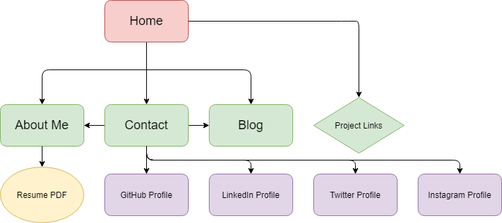
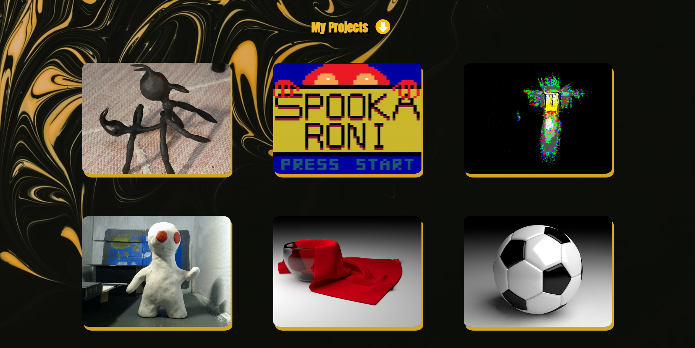
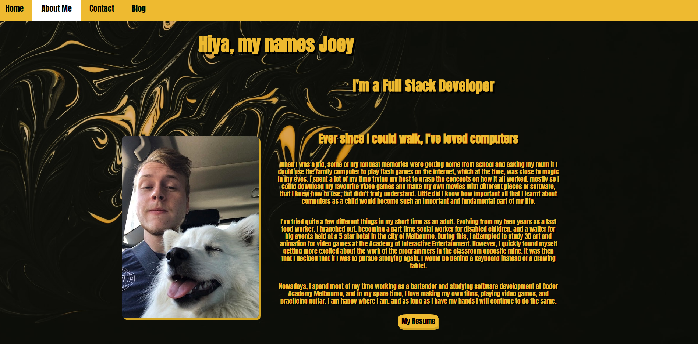
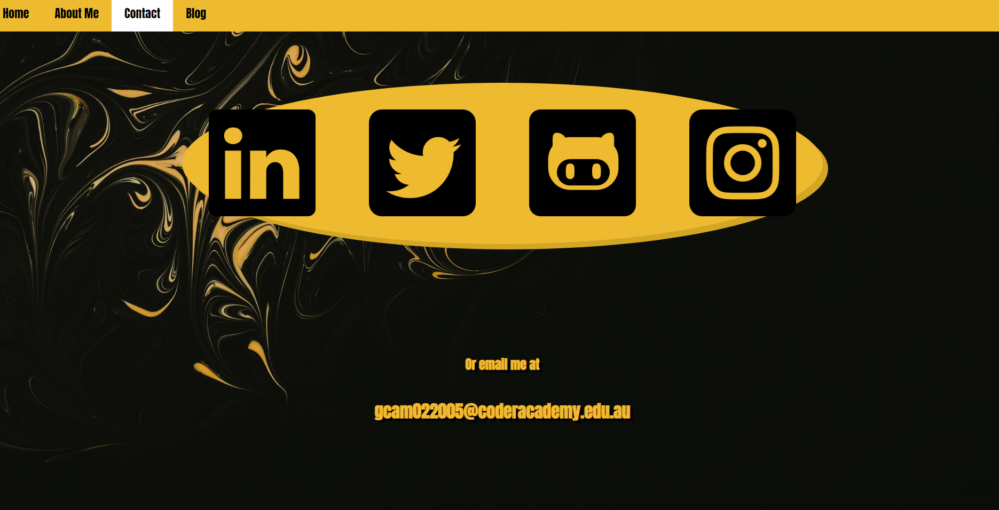
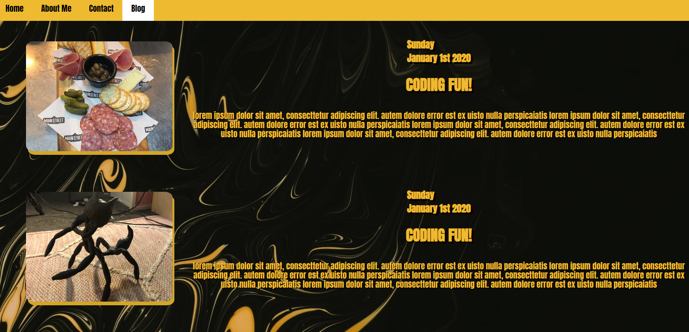

Link to deployed site: https://keen-snyder-3293e3.netlify.app/ 

Link to Github Repository: https://github.com/OldsterJoey/portfoliosite

## Purpose
The purpose of my website is to serve as a portfolio for me to sell myself as a developer and show off my work that I will do in the upcoming months at coder academy, and also some other independent projects.

## Functionality & Features
All content of the site is easily explorable due to my navbar feature, and includes a projects and blog section, that format content within the container automatically, my resume in the form of an online PDF, and a contacts section with all my social media connected by links. It also features Sub Resource Integrity attached to each of my CSS files in order to give my website security.

## Target Audience
My target audience will be Employers within the tech industry, with other targets being general Employers or fellow developers or artists.

## Tech Stack

HTML
CSS, GitHub, Netlify, Sub Resource Integrity

#### Sitemap

## Screenshots

